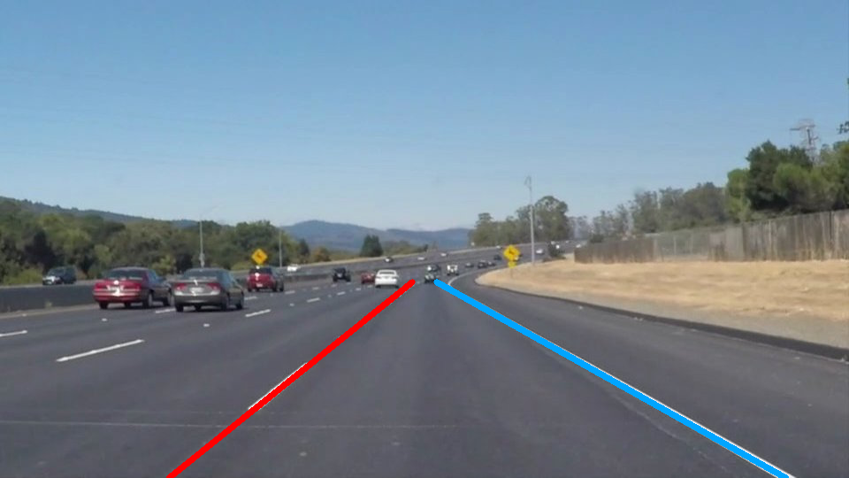
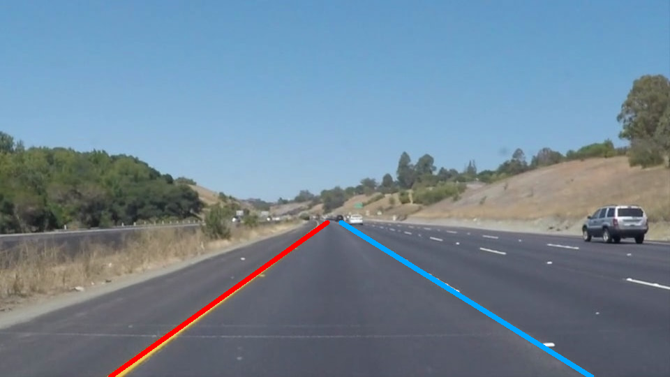
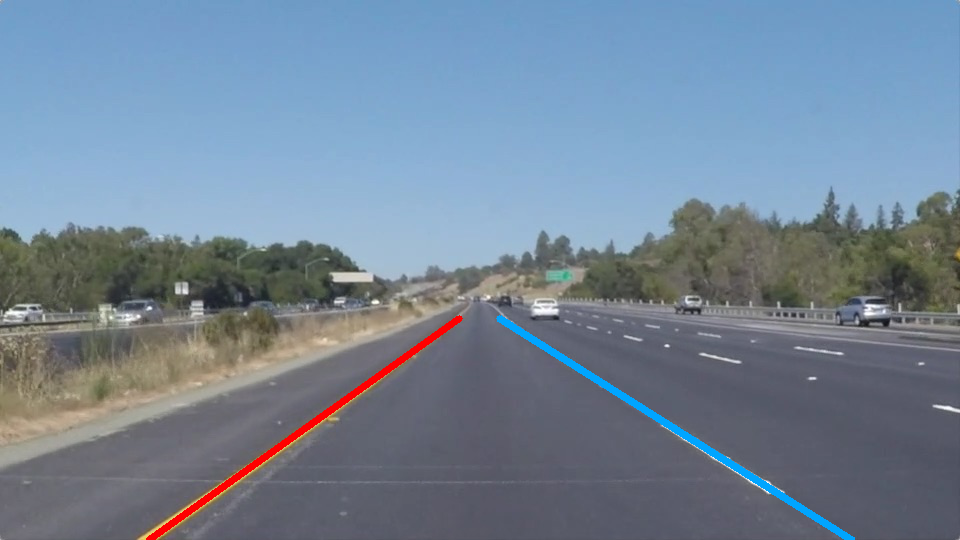

# **Project \#1**

# **Finding Lane Lines on the Road** 
## **Goals of this project:** 

* To make a pipline that finds lane lines on the road
* Reflect on your work in a written report

## **Reflection**

1. **Describe your pipline. As part of the description, explain how you modified the draw_lines() function.**
   > Here are the steps I followed to make it work
     * Read one image at a time from file
     * Converted the image into grayscale (black and white). At this step, both the yellow and white markings will be conveted into less white and white markings respectively.
     * Applied Gaussian bluring to reduce possible noise and some spurious gradients. This blurring operation makes the image smoothed - which is useful for the next operation.
     * Canny edge detector is used to find out the edges of the lane markings (The assumption here is the asphalt road is black in color and the markings are brighter than the road. As a result, there is intensity gradient around the lane paints. This feature is extracted by the Canny edge detector with appropriate thresholds.
     * Region of interest (ROI) is defined to accommodate the lane paints. This step simplifies the detection process by ignoring image parts outside the defined region.
     * Line segments are computed based on the edge information using the Hough transformation.
     * Line segments are analysed based on slope information and then categorized in to two groups: left and right lane line segments. Positive slope indicates the left lane and vice-versa.
     * Linear regression technique is applied to find a straight line that best fits the grouped line segments for the left and right lanes.
     * Based on the slope and the y-intercept information obtained from the previous step, the extremum points/coordinates of the lines are computed to fit in the region of interest.
     * Finaly, the lines are drawn on top of the original image.
     

  > Regarding the **_`draw_line()`_** function, I did not modify it. The required feature is already included in the main part of the code (which I found it convenient).

2. **Identify potential shortcomings with your current pipline.**
     > The shortcoming in my pipeline is that the slope analysis I used to group line segments is not good enough to accurately estimate the lane lines. Consequently, the linear regression output to represent the lane line is inaccurate. In addition, the yellow line and the white line do not have similar intensity level when converted to grayscale image (The edge map result from the yellow line is not as good as from the white line) which results in inaccurate detection.
  
3. **Suggest possible improvements to your pipline**
     > Improved results could be obtained if color based detection is somehow combined with the edge based detection method. Although both techniques have their own advantes and disadvantages, I believe that using them together will produce more accurate results.
  
## **Some of the results**
 
 Input image                                | Output image
 ------------------------------------------ | ------------
 |  
 | 
 | 

## **Video**
Link: [video output](test_videos_output/solidWhiteRight.mp4)
<video width="960" height="540" controls> 
  <source type="video/mp4" src="test_videos_output/solidWhiteRight.mp4"> 
</video>

~~~~~~~~~~~~~~~~~~~~~ END ~~~~~~~~~~~~~~~~~~~~~~
