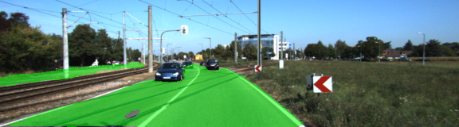

# Semantic Segmentation - drivable road detection

  Starter code for this project (https://github.com/udacity/CarND-Semantic-Segmentation). 

> Objective of this project is to label the pixels of a road in images using the VGG16 Fully Convolutional Network (FCN). 
## Example output


## Requirements
1. Python 3
2. TensorFlow (old version is used for this project)
3. NumPy
4. SciPy
5. PIL

## Dataset
> [Kitti Road dataset](http://www.cvlibs.net/datasets/kitti/eval_road.php) from [data_road.zip](http://www.cvlibs.net/download.php?file=data_road.zip)

##### Run
Run the following command to run the project:
```
python main.py
```

## More info about this project

> https://github.com/udacity/CarND-Semantic-Segmentation/edit/master/README.md

