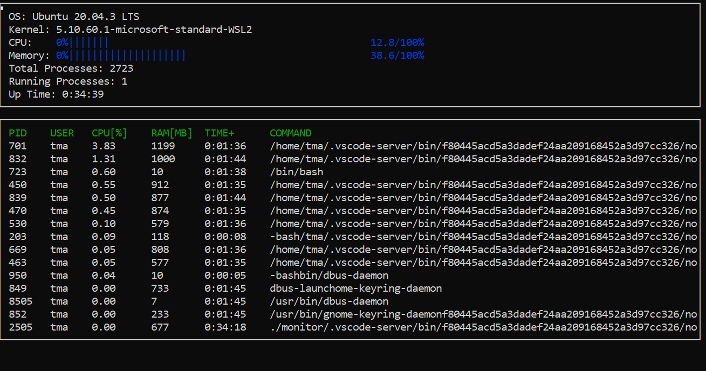

# System-Monitor Project

Starter code for System Monitor Project in the Object Oriented Programming Course of the [Udacity C++ Nanodegree Program](https://www.udacity.com/course/c-plus-plus-nanodegree--nd213). 

> Objective of this project is to implement a system-monitor just like the popular 'htop'.
Look at the code in the ```src/linux_parser.cpp```. It simply reads the linux file system such as os version, kernel, process IDs, memory utilization ...etc and displays it on the monitor. 



## Dependency
## ncurses
[ncurses](https://www.gnu.org/software/ncurses/) is a library that facilitates text-based graphical output in the terminal. This project relies on ncurses for display output.

Install ncurses within your own Linux environment: `sudo apt install libncurses5-dev libncursesw5-dev`

## Make
This project uses [Make](https://www.gnu.org/software/make/). The Makefile has four targets:
* `build` compiles the source code and generates an executable
* `format` applies [ClangFormat](https://clang.llvm.org/docs/ClangFormat.html) to style the source code
* `debug` compiles the source code and generates an executable, including debugging symbols
* `clean` deletes the `build/` directory, including all of the build artifacts

## Instructions

1. If you want to challenge yourself, clone the udacity repo and complete the 'TODO's in each ```src/*.cpp``` file. `git clone https://github.com/udacity/CppND-System-Monitor-Project-Updated.git`
2. Otherwise, clone this project 
3. Build the project: `make build`
4. Run the resulting executable: `./build/monitor`
